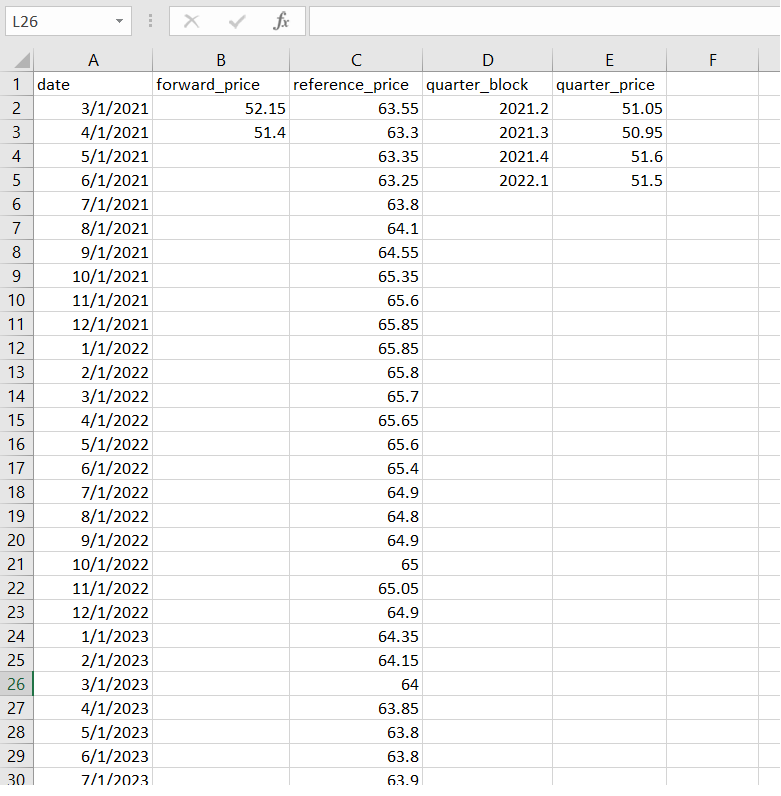

```{r setup, include=FALSE}
knitr::opts_chunk$set(message=FALSE, warning=FALSE, echo = TRUE)
```

```{r, message=FALSE, warning=FALSE}
# Necessary imports
library(tidyverse)
library(readxl)
library(ggplot2)
library(lubridate)
library(gridExtra)
library(zoo)
library(broom)
library(kableExtra)
library(corrplot)
```

In this script I will demonstrate an example of creating a "[Forward Curve](https://en.wikipedia.org/wiki/Forward_curve#:~:text=The%20forward%20curve%20is%20a,payment%20can%20be%20concluded%20today.&text=The%20forward%20curve%20represents%20a%20term%20structure%20of%20prices.)" using optimization. These curves have extensive application in finance and more specifically in the context of [futures contracts](https://www.investopedia.com/terms/f/futurescontract.asp#:~:text=A%20futures%20contract%20is%20a,specified%20time%20in%20the%20future.&text=The%20buyer%20of%20a%20futures,when%20the%20futures%20contract%20expires.) of various commodities such as crude oil, LPG, etc.

The task here is to construct the missing points of the forward curve by satisfying the given quarterly blocks (first constraint) and imitating as much as possible the shape of the given reference curve (second constraint).

Let's first take a look at the data set in depth.


### 1- The Data


```{r}
# Let's read the data in 
data <- read_excel("data/opt.xlsx")
data
```


**Observations:**

- There are a total of **52** observations for the `reference_price` for the **1st** day of each month (from **March, 2021** to **June, 2025**, inclusive).

- Four quarter block average prices have been provided including: `2nd`, `3rd`, `4th` of **2021** and `1st` of **2022**. These should be met while building the `forward_price.`

- There are two values provided for the `forward_price` (**March** and **April**, 2021). The goal here is to build the `forward_price` so that it satisfies the given quarter blocks  and follows the same trend as the `reference_price` at the same time.


### 2- EDA

Let's take a look at the trend of `reference_price` over the given time.

```{r}
# Plotting reference_price vs Time
ggplot(data, aes(date, reference_price)) +
       geom_line(color="blue") + ggtitle("Reference Price vs Time") + 
  geom_point(color="blue") +
    xlab("Date") + ylab("Reference Price ($)") 
```


```{r}
# Splitting the data set into 5 splits based on year
data_modified <- data[, c(1,3)] %>% mutate(date = ymd(date)) %>% 
  mutate_at(vars(date), funs(year, day, month))
data_split <- split(data_modified, data_modified$year)

data_2021 <- data.frame(data_split[1]) %>% setNames(names(data_modified))
data_2022 <- data.frame(data_split[2]) %>% setNames(names(data_modified))
data_2023 <- data.frame(data_split[3]) %>% setNames(names(data_modified))
data_2024 <- data.frame(data_split[4]) %>% setNames(names(data_modified))
data_2025 <- data.frame(data_split[5]) %>% setNames(names(data_modified))

# Plotting Reference Price for each year
plot_2021 <- ggplot(data=data_2021, aes(x=month, y=reference_price)) +
  geom_line(color="blue")+
  geom_point(color="blue") + labs(title="Reference Price in 2021",
        x ="Month of the Year", y = "Reference Price ($)") + scale_x_continuous(breaks = round(seq(min(data_2021$month), max(data_2021$month), by = 1),1)) 

plot_2022 <- ggplot(data=data_2022, aes(x=month, y=reference_price)) +
  geom_line(color="blue")+
  geom_point(color="blue") + labs(title="Reference Price in 2022",
        x ="Month of the Year", y = "Reference Price ($)") + scale_x_continuous(breaks = round(seq(min(data_2022$month), max(data_2022$month), by = 1),1))

plot_2023 <- ggplot(data=data_2023, aes(x=month, y=reference_price)) +
  geom_line(color="blue")+
  geom_point(color="blue") + labs(title="Reference Price in 2023",
        x ="Month of the Year", y = "Reference Price ($)") + scale_x_continuous(breaks = round(seq(min(data_2023$month), max(data_2023$month), by = 1),1))

plot_2024 <- ggplot(data=data_2024, aes(x=month, y=reference_price)) +
  geom_line(color="blue")+
  geom_point(color="blue") + labs(title="Reference Price in 2024",
        x ="Month of the Year", y = "Reference Price ($)") + scale_x_continuous(breaks = round(seq(min(data_2024$month), max(data_2024$month), by = 1),1))

plot_2025 <- ggplot(data=data_2025, aes(x=month, y=reference_price)) +
  geom_line(color="blue")+
  geom_point(color="blue") + labs(title="Reference Price in 2025",
        x ="Month of the Year", y = "Reference Price ($)") + scale_x_continuous(breaks = round(seq(min(data_2025$month), max(data_2025$month), by = 1),1))

grid.arrange(plot_2021, plot_2022, plot_2023, plot_2024, plot_2025, ncol=2)
```


**Observations:**

- The year-wise `reference_price` plots show that the price experiences a decreasing trend (usually until **June** of each year where it hits a local minimum) and then follows an increasing trend all the way to **December**. 


### 3- Data Wrangling


What I will be doing below is to build the `forward_price` by following the same rate as the given `reference_price.`


```{r}
# Necessary data wrangling
df <- data[, c(1:3)]
df <- df %>% 
  mutate(date = ymd(date)) %>% 
  mutate_at(vars(date), funs(year, day, month))
df <- df [-c(1)]
df <- df[, c(3, 5, 1, 2)]
df <- df %>% mutate(rate = round(((reference_price - lag(reference_price))/lag(reference_price)), 5))
df$forward_price[is.na(df$forward_price)] <- 0
df<- df %>% mutate(forward = (rate + 1))
df$date <- as.yearmon(paste(df$year, df$month), "%Y %m")
df <- df [-c(1, 2)]
df <- df[, c(5, 1, 2, 3, 4)]
# For loop to populate forward_price
for(i in 3:nrow(df)){
  
  df[["forward_price"]][i] =  round(df[["forward_price"]][i] + (df[["forward_price"]][i-1] * df[["forward"]][i]), 2)
}
df <- df[, -4:-5]
df
```


```{r, fig.width=12,fig.height=5}
# Plotting forward_price & reference_price
par(mfrow=c(1,2))
# df$reference_price %>% max()
plot(df$date, df$forward_price, type="l", col="red", xlab="Time", ylab="Forward Price ($)", ylim =c(50, 57),  main="Forward Price vs Time")
plot(df$date, df$reference_price, type="l", col="red", xlab="Time", ylab="Reference Price ($)", ylim =c(62, 69),  main="Reference Price vs Time")
```


As can be seen from the two plots above, the built `forward_price` follows the same trend as that of the `reference_price.`


### 4- Optimization

The way, I approach this optimization task is to see how I can optimize the created `forward_price` (that already follows the `reference_price` trend) so that the average price for the first 4 quarter blocks approximate the given quarter values.

In doing so, I will subset the the data for the first **13** observations (including the 4 quarter blocks, `2021-2`, `2021-3`, `2021-4`, `2022-1` and the observation for **March**, 2021).


```{r}
# Building df1 for the four quarter blocks
df1 <- df[c(1:13), ] %>% 
  rename(y_i = forward_price,
    x_i = reference_price)
df1
```


```{r}
# Plotting forward_price (y_i) as a function of reference_price (x_i)
plot(y_i ~ x_i, data = df1, main="Regression")

# Plotting correlation matrix
df1_cor = cor(df1[-1], method = c("pearson"))
corrplot(df1_cor)
```


**Observations:**


- There seems to be a linear relation between `forward_price` (${y}_i$) and `reference_price` (${x}_i$). 


So, I will define a function that assumes a linear relation between ${y}_i$ and ${x}_i$.


$$ \texttt{y}_i =  a \times \texttt{x}_i + b$$

Next, I will define a loss function that employs above function to make prediction and also calculates the `Sum of Squares` of the difference between **predicted** and **actual** quarter block averages as the **Loss Function**.


```{r}
#' Returns forward_price (y_i) as a Linear function of reference_price (x_i) in form of y_i = a(x_i) + b
#'
#' @param x_i 
#' @param param 
#'
#' @return y_i
#' @export
#'
#' @examples
#' fun_1(mtcars$cyl, c(1, 2))
fun_1 <- function(x_i, param) {
  param[1] + param[2] * x_i
}

#' Loss function for fun_1
#'
#' @param data 
#' @param param 
#'
#' @return Sum of squared errors of predictions from fun_1
#' @export
#'
#' @examples
#' loss_fun_1(mtcars, c(1, 2))
loss_fun_1 <- function(data, param) {
  preds <- fun_1(data$x_i, param)                  
  preds[1:2] <- c(52.15, 51.40)
  q1_err <- (mean(preds[2:4]) - 51.05)^2
  q2_err <- (mean(preds[5:7]) - 50.95)^2
  q3_err <- (mean(preds[8:10]) - 51.6)^2
  q4_err <- (mean(preds[11:13]) - 51.5)^2
  sum(q1_err, q2_err,  q3_err, q4_err)
}

# Optimizing the loss function using base R optim
result_1 <- optim(par = c(0, 0.5), fn = loss_fun_1, data = df1) 
result_1
```


Let's make predictions based on optimized values of the function parameters.


```{r}
# Predictions based on optimized parameters of fun_1
pred_1 <- result_1$par[1] +result_1$par[2] * df1$x_i
pred_1[1:2] <- c(52.15, 51.40)
df1$forward_price_optimized <- round(pred_1, 2)
df1 <- df1 %>% 
  rename(forward_price = y_i,
    reference_price = x_i)
df1
```


Below, I want to check how close the predicted (optimized) quarter blocks averages are with the actual given values.


```{r}
# Comparing non-optimized/optimized quarter blocks averages with given values
df1_quarters <- df1[2:13, c(2, 4)]
df1_quarters_avg <- df1_quarters %>% 
    summarize(forward_price_quarter_avg = round(colMeans(matrix(df1_quarters$forward_price, nrow=3)), 2),
              forward_price_optimized_quarter_avg = round(colMeans(matrix(df1_quarters$forward_price_optimized, nrow=3)), 2))
df1_quarters_avg$quarter_avg_set <- c(51.05, 50.95, 51.6, 51.5)
df1_quarters_avg %>% kbl(caption = "Comparing Quarter Blocks Averages")  %>%
         kable_classic(full_width = FALSE, html_font = "Cambria")

near(df1_quarters_avg$quarter_avg_set, df1_quarters_avg$forward_price_quarter_avg, tol = 1)  # to compare element-wise
near(df1_quarters_avg$quarter_avg_set, df1_quarters_avg$forward_price_optimized_quarter_avg, tol = 1)  # to compare element-wise
```

Looks like the **optimized** quarter block averages are much closer than the **non-optimized** values.


What I will do below, is to compare the trend of **optimized** `forward_price` with that of the `reference_price`.

```{r}
# Comparing forward_price_optimized vs reference_price trends
df1_long <- df1 %>%
  pivot_longer(!date, names_to = "price", values_to = "value")

ggplot(df1_long, aes(date, value, colour = price)) +
       geom_line() + ggtitle("Forward (non-optimized/optimized) vs Reference Price Trends")+ 
    xlab("Date") + ylab("Price ($)") +   
    labs(color='Type')

df1_diff <- df1 %>% mutate(forward_rate = round(((forward_price - lag(forward_price))/lag(forward_price)), 5),
                           reference_rate = round(((reference_price - lag(reference_price))/lag(reference_price)), 5),
                           forward_optimized_rate = round(((forward_price_optimized - lag(forward_price_optimized))/lag(forward_price_optimized)), 5))

df1_diff <- df1_diff %>% mutate(forward_dev = round((1-(forward_rate/reference_rate))*100, 2),
                                forward_optimized_dev = round((1-(forward_optimized_rate/reference_rate))*100, 2))

# df1_diff

# hist((df1_diff$forward_dev), main="Distribution of Forward Price Rate Deviations", xlab = "Deviation Percentage", ylim = c(0, 150), labels = TRUE)
# hist((df1_diff$forward_optimized_dev), main="Distribution of Forward-Optimized Price Rate Deviations", xlab = "Deviation Percentage", ylim = c(0, 150), labels = TRUE)

near(df1_diff$reference_rate, df1_diff$forward_rate, tol = 0.0001)  # to compare element-wise
all.equal(df1_diff$reference_rate, df1_diff$forward_rate, tolerance = 0)  # to check mean relative difference

near(df1_diff$reference_rate, df1_diff$forward_optimized_rate, tol = 0.0001)  # to compare element-wise
all.equal(df1_diff$reference_rate, df1_diff$forward_optimized_rate, tolerance = 0)  # to check mean relative difference
```

Looks like the optimized `forward_price` **almost** follows the same trend as that of the `reference_price` (maybe we can do better). Remember, this is for the first 13 observations which relate to the four quarter block averages.


The next step is to build the rest of `forward_price` values while satisfying the `reference_price` trend.


```{r}
# Populating the rest of forward_price_optimized
df1_populated <- df
df1_populated$forward_price_optimized <- c(df1$forward_price_optimized, replicate(39, 0))  # 39+13=52
df1_populated <- df1_populated[, -2]


df1_populated <- df1_populated %>% mutate(rate = round(((reference_price - lag(reference_price))/lag(reference_price)), 5))
df1_populated<- df1_populated %>% mutate(forward = (rate + 1))

# For loop to populate forward_price
for(i in 14:nrow(df1_populated)){
  
  df1_populated[["forward_price_optimized"]][i] =  round(df1_populated[["forward_price_optimized"]][i] +
                                                           (df1_populated[["forward_price_optimized"]][i-1] * df1_populated[["forward"]][i]), 2)
}

df1_populated <- df1_populated[, -4:-5]
df1_populated %>% kbl(caption = "Final Forwrad Price (optimized) vs Reference Price")  %>%
         kable_classic(full_width = FALSE, html_font = "Cambria")
```


#### 4-1 Alternative Model 


In this model, I will include the **lagged** `forward_price` (${y}_{i-1}$) as an independent variable.


```{r}
# Building df2 for the four quarter blocks
df2 <- df[c(1:13), ] %>% 
  rename(y_i = forward_price,
    x_i = reference_price) %>% mutate(y_i_1 = lag(y_i))
df2
```


```{r}
# Plotting forward_price (y_i) as a function of reference_price (x_i) & lagged forward_price (y_i_1)
plot(y_i ~ x_i, data = df2, main="Regression")
plot(y_i ~ y_i_1, data = df2, main="Regression")

# Plotting correlation matrix
df2_cor = cor(df2[-1, -1], method = c("pearson"))
corrplot(df2_cor)

# Checking the multiple regression model
fit <- lm(y_i ~ x_i + y_i_1, data=df2)
summary(fit) 
```


**Observations:**

- Looks like there is a relatively linear relation between `forward_price` and its lagged version.

So, I will define a function that represents above relation between ${y}_i$ and ${y}_{i-1}$ and build the **Loss Function** accordingly.


$$ \texttt{y}_i =  a \times \texttt{x}_i + b\times \texttt{y}_{i-1} + c$$


```{r}
#' Returns forward_price (y_i) as a Linear function of reference_price (x_i) & lagged forward_price (y_i_1) in form of y_i = a(x_i) + b(y_i_1) + c
#'
#' @param x_i, y_i_1 
#' @param param 
#'
#' @return y_i
#' @export
#'
#' @examples
#' fun_2(mtcars$cyl, c(1, 2, 3))
fun_2 <- function(x_i, y_i_1, param) {
  param[1] + param[2] * x_i + param[3] * (y_i_1)
}

#' Loss function for fun_2
#'
#' @param data 
#' @param param 
#'
#' @return Sum of squared errors of predictions from fun_2
#' @export
#'
#' @examples
#' loss_fun_2(mtcars, c(1, 2, 3))
# Loss function for fun_2
loss_fun_2 <- function(data, param) {
  preds <- fun_2(data$x_i, data$y_i_1, param)                  
  preds[1:2] <- c(52.15, 51.40)
  q1_err <- (mean(preds[2:4]) - 51.05)^2
  q2_err <- (mean(preds[5:7]) - 50.95)^2
  q3_err <- (mean(preds[8:10]) - 51.6)^2
  q4_err <- (mean(preds[11:13]) - 51.5)^2
  sum(q1_err, q2_err,  q3_err, q4_err)
}

# Optimizing the loss function using base R optim
result_2 <- optim(par = c(0, 0.5, 0.8), fn = loss_fun_2, data = df2) 
result_2
```

Let's make predictions based on optimized values of the function parameters.


```{r}
# Predictions based on optimized parameters of fun_2
pred_2 <- result_2$par[1] + result_2$par[2] * df2$x_i + result_2$par[3] * df2$y_i_1
pred_2[1:2] <- c(52.15, 51.40)
df2$forward_price_optimized <- round(pred_2, 2)
df2 <- df2 %>% 
  rename(forward_price = y_i,
    reference_price = x_i,
    lagged_forward_price = y_i_1) 
df2
```


Below, I want to check how close the predicted (**optimized**) quarter blocks averages are with the actual given values.


```{r}
# Comparing non-optimized/optimized quarter blocks averages with given values
df2_quarters <- df2[2:13, c(2, 5)]
df2_quarters_avg <- df2_quarters %>% 
    summarize(forward_price_quarter_avg = round(colMeans(matrix(df2_quarters$forward_price, nrow=3)), 2),
              forward_price_optimized_quarter_avg = round(colMeans(matrix(df2_quarters$forward_price_optimized, nrow=3)), 2))
df2_quarters_avg$quarter_avg_set <- c(51.05, 50.95, 51.6, 51.5)
df2_quarters_avg %>% kbl(caption = "Comparing Quarter Blocks Averages")  %>%
         kable_classic(full_width = FALSE, html_font = "Cambria")

near(df2_quarters_avg$quarter_avg_set, df2_quarters_avg$forward_price_quarter_avg, tol = 1)  # to compare element-wise
near(df2_quarters_avg$quarter_avg_set, df2_quarters_avg$forward_price_optimized_quarter_avg, tol = 1)  # to compare element-wise
```

Looks like the **optimized** quarter block averages are much closer than the **non-optimized** values.


What I will do below, is to compare the trend of **optimized** `forward_price` with that of the `reference_price`.


```{r}
# Comparing forward_price_optimized vs reference_price trends
df2_long <- df2[, -4] %>%
  pivot_longer(!date, names_to = "price", values_to = "value")

ggplot(df2_long, aes(date, value, colour = price)) +
       geom_line() + ggtitle("Forward (non-optimized/optimized) vs Reference Price Trends")+ 
    xlab("Date") + ylab("Price ($)") +   
    labs(color='Type')

df2_diff <- df2[, -4] %>% mutate(forward_rate = round(((forward_price - lag(forward_price))/lag(forward_price)), 5),
                           reference_rate = round(((reference_price - lag(reference_price))/lag(reference_price)), 5),
                           forward_optimized_rate = round(((forward_price_optimized - lag(forward_price_optimized))/lag(forward_price_optimized)), 5))
df2_diff <- df2_diff %>% mutate(forward_dev = round((1-(forward_rate/reference_rate))*100, 2),
                                forward_optimized_dev = round((1-(forward_optimized_rate/reference_rate))*100, 2))
# df2_diff

# hist((df2_diff$forward_dev), main="Distribution of Forward Price Rate Deviations", xlab = "Deviation Percentage", ylim = c(0, 150), labels = TRUE)
# hist((df2_diff$forward_optimized_dev), main="Distribution of Forward-Optimized Price Rate Deviations", xlab = "Deviation Percentage", ylim = c(0, 150), labels = TRUE)

near(df2_diff$reference_rate, df2_diff$forward_rate, tol = 0.0001)  # to compare element-wise
all.equal(df2_diff$reference_rate, df2_diff$forward_rate, tolerance = 0)  # to check mean relative difference

near(df2_diff$reference_rate, df2_diff$forward_optimized_rate, tol = 0.0001)  # to compare element-wise
all.equal(df2_diff$reference_rate, df2_diff$forward_optimized_rate, tolerance = 0)  # to check mean relative difference
```

Looks like the optimized `forward_price` closely follows the same trend as that of the `reference_price` (better than the first model). 


The next step is to build the rest of `forward_price` values while satisfying the `reference_price` trend.


```{r}
# Populating the rest of forward_price_optimized
df2_populated <- df
df2_populated$forward_price_optimized <- c(df2$forward_price_optimized, replicate(39, 0)) # 39+13=52
df2_populated <- df2_populated[, -2]


df2_populated <- df2_populated %>% mutate(rate = round(((reference_price - lag(reference_price))/lag(reference_price)), 5))
df2_populated<- df2_populated %>% mutate(forward = (rate + 1))

# For loop to populate forward_price
for(i in 14:nrow(df2_populated)){
  
  df2_populated[["forward_price_optimized"]][i] =  round(df2_populated[["forward_price_optimized"]][i] +
                                                           (df2_populated[["forward_price_optimized"]][i-1] * df2_populated[["forward"]][i]), 2)
}

df2_populated <- df2_populated[, -4:-5]
df2_populated %>% kbl(caption = "Final Forwrad Price (optimized) vs Reference Price")  %>%
         kable_classic(full_width = FALSE, html_font = "Cambria")
```


### 5- Conclusions

In this analysis, I made an attempt to construct the missing points of the forward curve by satisfying the given quarterly blocks and imitating as much as possible the shape of the given Reference curve.




In doing so, I initially built a model that follows a **linear** relation between `reference_price` and `forward_price` and optimized it through minimizing the sum of squared errors of the predictions made by the model.

I also, built an alternative model which takes the **lagged** version of `forward_price` into account. 

Results show that the alternative model does a better job in overall.

### This is the end of the script.